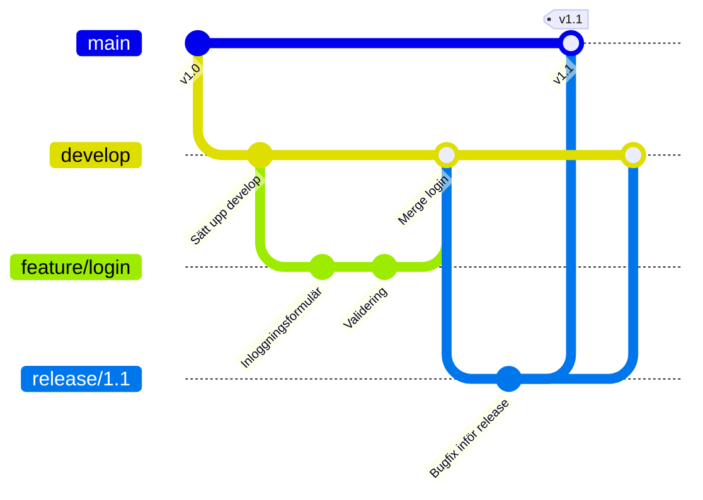
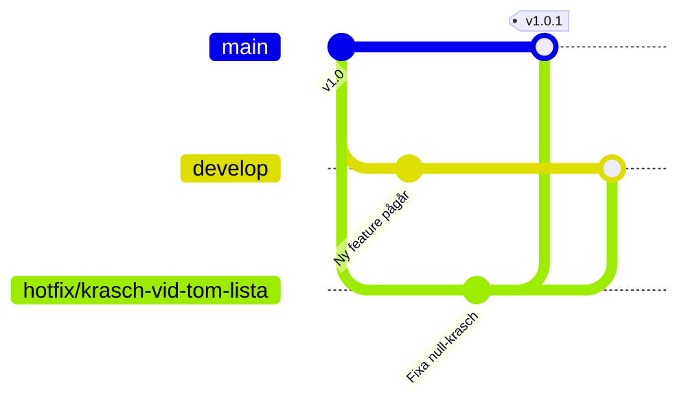

# Git Flow

## Grundidén

Git Flow (myntad av Vincent Driessen 2010) är den mest strukturerade branching-strategin — den definierar **fem** olika typer av branches, var och en med ett specifikt syfte och en specifik livslängd.

## De fem branch-typerna

| Branch | Livslängd | Syfte |
|--------|-----------|-------|
| `main` | Permanent | Alltid produktionsklar kod, en commit per release |
| `develop` | Permanent | Integrationsgren där färdiga features samlas innan nästa release |
| `feature/*` | Tillfällig | En ny funktion, grenar ut från `develop`, mergas tillbaka dit |
| `release/*` | Tillfällig | Sista finputsningen (bugfix, versionsnummer) innan en release går till `main` |
| `hotfix/*` | Tillfällig | Akut fix direkt på produktionskod, grenar ut från `main`, mergas till **både** `main` och `develop` |

## Hotfix — den branch som går utanför det vanliga flödet

Om en kritisk bugg upptäcks i produktion kan du inte vänta på att hela `develop` blir klar för nästa release. En `hotfix/*`-branch grenas direkt från `main`, fixar buggen, och mergas tillbaka till **både** `main` (så produktionen får fixen direkt) och `develop` (så inte samma bugg dyker upp igen i nästa release).

## Fördelar och nackdelar

**Fördelar:**
- Mycket tydligt vad varje branch är till för
- Passar bra för produkter med **schemalagda releaser** (t.ex. en app som släpper version 2.0, 2.1, 2.2 med tydliga mellanrum)
- `main` är alltid garanterat produktionsklar

**Nackdelar:**
- Många branches att hålla reda på — tungt för ett litet team
- Feature-branches kan bli **långlivade**, vilket ökar risken för stora, smärtsamma merge-konflikter
- Passar dåligt för team som vill leverera **kontinuerligt** (flera gånger om dagen) snarare än i schemalagda releaser

## När passar Git Flow?

Produkter med tydliga versionsnummer och releaser som inte händer varje dag — installerad mjukvara, mobilappar med App Store-granskning, eller projekt med flera parallella supporterade versioner samtidigt. Passar sämre för webbtjänster som deployar kontinuerligt — där är [Trunk-based development](trunk-based.md) eller [GitHub Flow](github-flow.md) vanligare.
