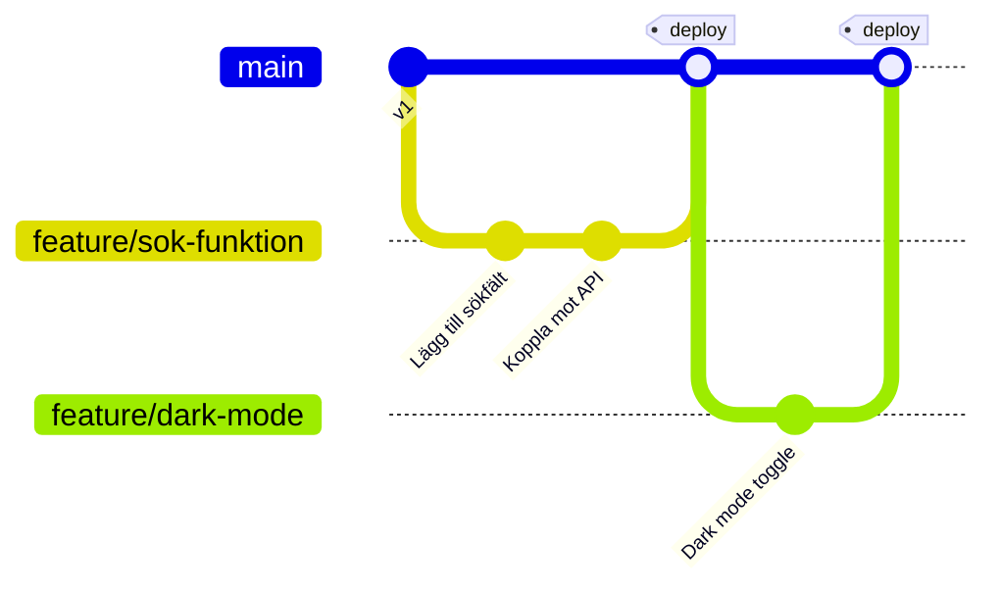
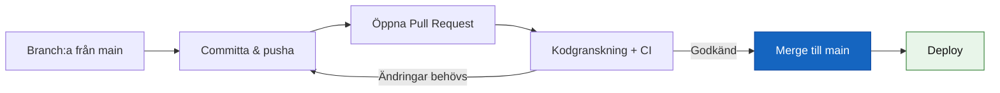

# GitHub Flow

## Grundidén

GitHub Flow är Git Flows enkla motsats — **en** permanent branch (`main`) och korta, kortlivade feature branches. Ingen `develop`, ingen `release/*`, ingen `hotfix/*`. Allt som mergas till `main` ska kunna deployas direkt.

## Flödet i fem steg

1. **Branch:a ut från `main`** — namnge branchen beskrivande: `feature/sok-funktion`, `fix/krasch-vid-inloggning`
2. **Committa och pusha ofta** — så teamet kan följa med och ge feedback tidigt
3. **Öppna en Pull Request** — även innan koden är helt klar, för tidig diskussion
4. **Granska och diskutera** — teamet kommenterar, CI-tester körs automatiskt
5. **Mergea till `main` och deploya** — så fort PR:en är godkänd

## Varför fungerar det utan develop/release-grenar?

Förutsättningen är att `main` **alltid** är deploybar — det säkerställs av automatiserade tester i CI/CD-pipelinen, inte av en separat integrationsgren. Istället för att samla upp features i `develop` och testa allt tillsammans innan en stor release, testas varje liten förändring för sig, direkt innan den mergas.

## Fördelar och nackdelar

**Fördelar:**
- Enkelt att förstå — en regel: `main` är alltid deploybar
- Passar perfekt för **kontinuerlig leverans** (flera deploys om dagen)
- Färre branches att hålla reda på, mindre administration

**Nackdelar:**
- Kräver bra CI/CD och testtäckning — utan det blir "main alltid deploybar" ett tomt löfte
- Inga separata release-versioner att peka på om du behöver supportera flera versioner parallellt hos olika kunder
- Ingen inbyggd plats för större, riskfyllda förändringar som behöver mogna över tid innan de släpps

## När passar GitHub Flow?

Webbtjänster och SaaS-produkter som deployar kontinuerligt till en enda produktionsmiljö — precis den typen av projekt GitHub själva byggde modellen för. Passar sämre för produkter med schemalagda versionssläpp eller flera parallellt supporterade versioner, där [Git Flow](git-flow.md) ger tydligare struktur.
