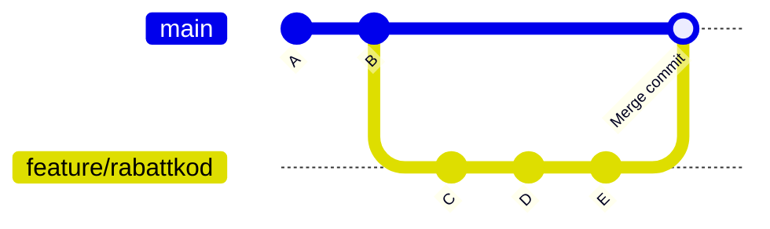
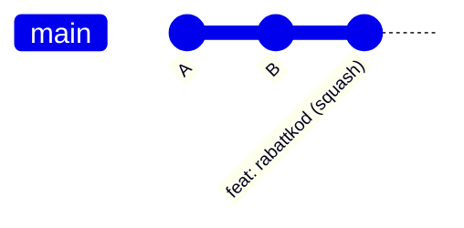
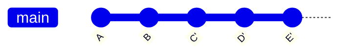

# Merge-strategier

Du har jobbat i tre dagar på en feature branch. Den är klar, testad, godkänd i PR:en. Nu ska den in i `main`.

Hur?

Det är inte en dum fråga — det finns tre sätt, och de ger väldigt olika historik. Väljer du fel syns det i `git log` länge.

## De tre sätten

### Merge (merge commit)

Det klassiska alternativet. Git skapar en ny "merge commit" som säger att de två brancherna gick ihop vid den här tidpunkten.

```bash
git checkout main
git merge feature/kundvagn-rabattkod
```



Historiken är **exakt sann** — du kan se precis när branchen skapades, vad som hände på den, och när den mergades. Bra för transparens, men `git log` fylls snabbt med merge-commits om teamet jobbar med många branches parallellt.

**Passar:** Git Flow, historik som ska spegla verkligheten exakt.

---

### Squash (squash merge)

Alla commits på feature-branchen pressas ihop till **en enda** commit på `main`. Feature-branchen med alla sina `"wip"` och `"fixar min fix"` försvinner — bara slutresultatet syns.

```bash
git checkout main
git merge --squash feature/kundvagn-rabattkod
git commit -m "feat: kundvagn — lägg till stöd för rabattkoder"
```



Tre commits på feature-branchen (`C`, `D`, `E`) ovan ser ut som en enda commit i `main`. Historiken blir **renare och mer läsbar** — varje feature är en atomic enhet. Baksidan: du tappar detaljerna om du någonsin vill förstå hur en specifik rad uppkom.

**Passar:** GitHub Flow, team som värdesätter en ren historik.

---

### Rebase

Istället för att slå ihop brancherna "spelas" commits från feature-branchen av **ovanpå** `main`, en i taget, som om branchen aldrig hade existerat.

```bash
git checkout feature/kundvagn-rabattkod
git rebase main
git checkout main
git merge feature/kundvagn-rabattkod  # fast-forward, inga merge commits
```



`C'`, `D'` och `E'` är tekniskt sett nya commits — samma innehåll som `C`, `D`, `E` men med ny hash och ny startpunkt. Historiken ser ut som om allt alltid jobbat rakt fram på `main`. Extremt ren, men:

> **Rör aldrig en delad branch med rebase.**

Om du rebasar `main` eller en branch som andra jobbar på har du skrivit om historiken de bygger på. Deras commits pekar nu på commits som inte finns längre. Det är ett bra sätt att förstöra en måndag.

**Passar:** Lokalt, på din egna branch, innan du öppnar en PR — för att städa upp röriga commit-meddelanden.

---

## Hur väljer man?

| Situation                              | Rekommendation                                 |
| -------------------------------------- | ---------------------------------------------- |
| Feature branch in i main (GitHub Flow) | Squash — en feature = en commit                |
| Hotfix eller release branch (Git Flow) | Merge — bevara exakt historik                  |
| Städa upp din egna branch innan PR     | Rebase lokalt (bara du påverkas)               |
| Din branch är efter main               | Rebase (hämtar senaste main utan merge-commit) |
| Delad branch                           | Merge — aldrig rebase                          |

## Snabbguide: är branchen delad?

```bash
git log origin/feature/rabattkod..feature/rabattkod
```

Om det här kommandot ger output finns det commits lokalt som inte finns på origin — ingen annan har den. Rebase är OK. Om kommandot inte ger något (eller du vet att någon annan hämtat branchen) — kör merge istället.
