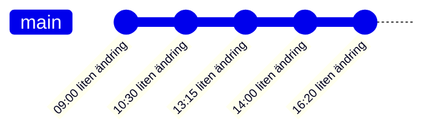
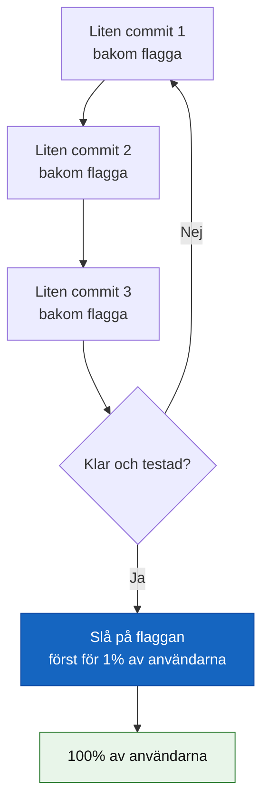

# Trunk-based development

## Grundidén

Trunk-based development går längre än GitHub Flow: så gott som **alla** committar direkt till huvudgrenen (`trunk`/`main`), i väldigt små steg, flera gånger om dagen. Branches — om de överhuvudtaget används — lever i timmar, inte dagar.



Inga veckolånga feature-branches, inga stora merge-konflikter att reda ut — eftersom varje förändring är liten och integreras nästan omedelbart.

## Problemet: hur bygger man en stor funktion i småbitar?

Om alla commitar direkt till `main` flera gånger om dagen — hur undviker man att en halvfärdig, stor funktion syns för användarna? Svaret är **feature flags** (funktionsflaggor): koden för den nya funktionen finns i `main`, men är avstängd bakom ett villkor tills den är klar.

```csharp
if (featureFlags.IsEnabled("nytt-kassaflode"))
{
    VisaNyttKassaflode();
}
else
{
    VisaGamlaKassaflode();
}
```

Utvecklarna bygger funktionen i små, kontinuerligt integrerade steg — men den är osynlig för riktiga användare tills flaggan slås på, ofta bara för en liten testgrupp först.



## Fördelar och nackdelar

**Fördelar:**
- Näst intill inga merge-konflikter — ändringarna är för små och integreras för ofta för att hinna divergera
- Extremt snabb feedback-loop — kod är i produktion (om än bakom en flagga) inom timmar
- Tvingar fram bra vanor: små commits, bra testtäckning, disciplinerad kodgranskning

**Nackdelar:**
- Kräver mogen CI/CD-kultur och hög testtäckning — utan det blir `main` instabilt
- Feature flags är extra komplexitet att hantera och städa bort när funktionen är klar och stabil
- Svårt att införa i ett team som inte redan har vana vid täta, disciplinerade commits

## Jämförelse — alla tre strategierna

| | Git Flow | GitHub Flow | Trunk-based |
|---|---|---|---|
| Antal branch-typer | 5 (main, develop, feature, release, hotfix) | 2 (main, feature) | I princip 1 (main/trunk) |
| Branch-livslängd | Dagar till veckor | Timmar till dagar | Timmar, eller inga alls |
| Kräver feature flags | Nej | Sällan | Ofta |
| Passar | Schemalagda releaser, flera supporterade versioner | Kontinuerlig deploy till en miljö | Mycket täta deploys, mogen CI/CD-kultur |

Ingen av de tre är "bäst" i något absolut mening — valet beror på hur ofta ni faktiskt levererar, hur bra er testtäckning är, och hur många versioner ni behöver hålla igång parallellt.
