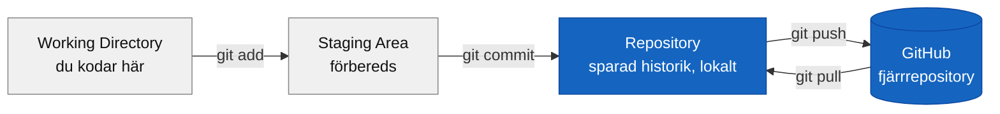
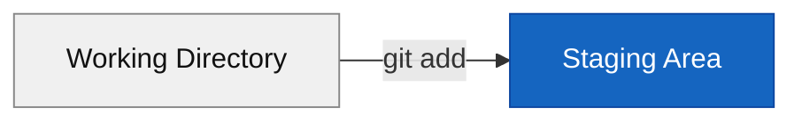
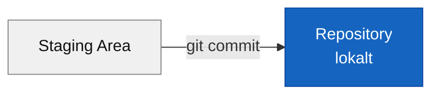
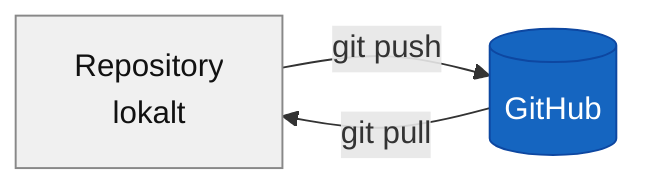
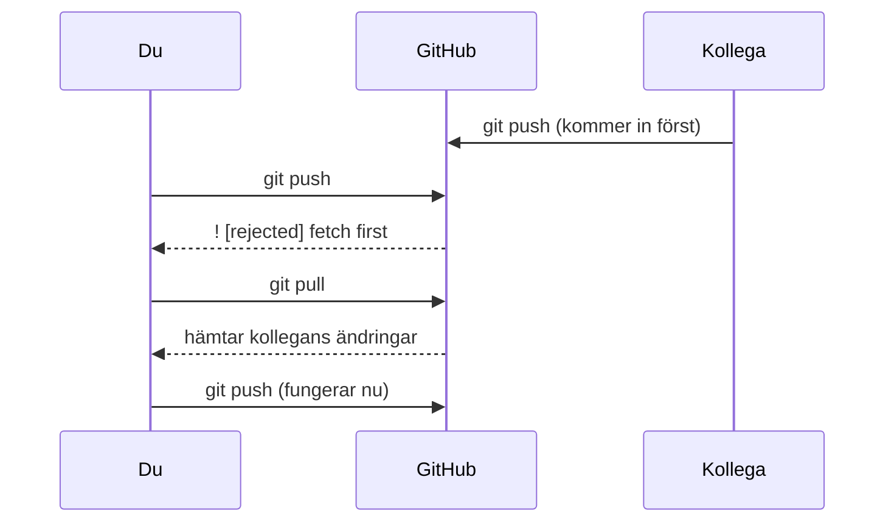
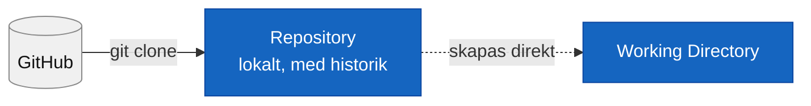

# De tre områdena

Tre begrepp förklarar hela Git-flödet:

- **Working Directory** — mappen där du faktiskt kodar. Vanlig redigering, som vanligt.
- **Staging Area** — en förberedelseplats. Du väljer vilka filer som ska ingå i nästa sparning (`git add`).
- **Repository** — den faktiska historiken. `git commit` skapar en permanent ögonblicksbild av allt som är stagat.



GitHub är ett **fjärrrepository** — en kopia av historiken som ligger online. Du synkar dit med `git push` (ladda upp) och hämtar med `git pull` (ladda ner).

## git add — Working Directory → Staging Area

Flyttar en ändring till förberedelseplatsen — du säger "ja, den här filen ska vara med i nästa sparning."

```bash
git add Program.cs    # en specifik fil
git add .             # alla ändrade filer
```



## git commit — Staging Area → Repository

Tar allt som är stagat och skapar en permanent ögonblicksbild i historiken.

```bash
git commit -m "Lägg till validering av e-postadress"
```



**Vad gör ett bra commit-meddelande?** Det förklarar **vad** och **varför** — koden visar redan **hur**.

```bash
# Bra
git commit -m "Fixa krasch när lista är tom"

# Dåligt — säger ingenting
git commit -m "fix"
git commit -m "asdf"
```

Commit-historiken är din dokumentation. Tre månader senare, när du undrar varför ett beslut togs, är ett bra meddelande guld värt.

## git push / git pull — Repository ↔ GitHub

`git push` skickar din lokala historik till GitHub. `git pull` hämtar ner det som finns där men inte hos dig.

```bash
git push    # ladda upp dina commits
git pull    # hämta andras commits
```



**Varför blir push ibland avvisad?** Om GitHub har commits du inte har lokalt (t.ex. en kollega pushat före dig) säger Git nej:

```plaintext
! [rejected] main -> main (fetch first)
```



Lösningen är alltid samma: `git pull` innan `git push`. Ännu bättre vana — pulla *innan* du börjar jobba, inte bara innan du pushar.

## git clone — GitHub → din dator

Hämtar ett befintligt repo från GitHub ner till din dator — en fullständig kopia, historik och allt.

```bash
git clone git@github.com:anvandarnamn/repo-namn.git
cd repo-namn
```



Till skillnad från `git add`/`git commit`/`git push` (som flyttar *dina* ändringar framåt steg för steg) går `git clone` motsatt väg — en engångskopia av allt, direkt från GitHub till din dator.
