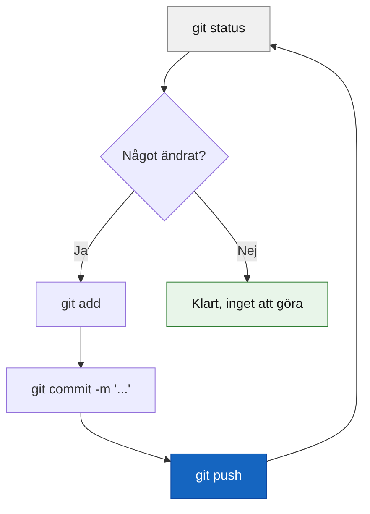
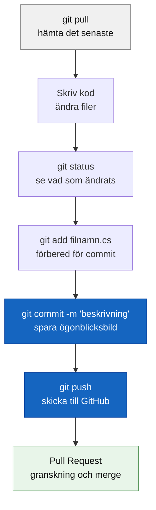

# Vanliga kommandon

## git status — kolla läget innan du gör något

Det kommandot du ska köra **innan** du gör något annat. Det visar exakt vad som ändrats sedan senaste commit.

```bash
git status
```

```plaintext
On branch main
Changes not staged for commit:
  modified:   Program.cs
```

**Ritualen:** `git status` → `git add` → `git commit` → `git push`. Varje gång. Det blir en ryggmärgsreflex efter ett par veckor.



## git init — starta ett nytt repo

Förvandlar en vanlig mapp till ett Git-repo. Används när du startar ett helt nytt projekt som inte finns på GitHub än.

```bash
git init
git remote add origin git@github.com:dittnamn/repo-namn.git
git add .
git commit -m "Initial commit"
git push -u origin main
```

`-u origin main` behövs bara den första gången — efteråt räcker `git push`.

## Hela arbetsflödet



## .gitignore

En fil i projektets rot som talar om för Git vilka filer som aldrig ska sparas i historiken.

```plaintext
bin/
obj/
.vs/
*.user
.env
secrets.json
```

`bin/` och `obj/` kan vara hundratals megabyte och genereras om automatiskt — ingen anledning att spara dem. `.env` och `secrets.json` kan innehålla lösenord och API-nycklar — om de hamnar på GitHub kan de missbrukas av automatiserade bottar inom minuter.

**Tumregel:** skapa `.gitignore` **innan** din första commit, inte efteråt. Har du råkat commita känsliga filer är de i historiken för alltid — du måste rensa hela historiken, inte bara filen.

## SSH-nyckel

Ett par av filer — en privat (stannar på din dator) och en publik (läggs på GitHub) — som låter dig ansluta till GitHub utan att skriva lösenord varje gång.

```bash
ssh-keygen -t ed25519 -C "din@email.com"
cat ~/.ssh/id_ed25519.pub
ssh -T git@github.com
```

```plaintext
Hi dittnamn! You've successfully authenticated
```

Behövs framför allt om du hanterar mer än ett GitHub-konto på samma dator. En enda inloggning räcker det att logga in via webbläsaren när Git frågar första gången.
