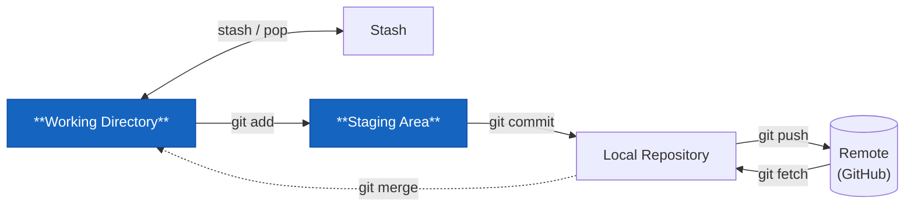

# git add



Flytta ändringar från working directory till staging area. Du bestämmer exakt vad som ska ingå i nästa commit.

```bash
git add filnamn.cs          # en specifik fil
git add src/                # hela mappen
git add .                   # allt som ändrats
git add -p                  # interaktivt — välj rad för rad
```

## Varför inte alltid `git add .`?

`git add .` tar **allt** — inklusive filer du inte menat att committa. En temporär testfil, ett lösenord du glömt i `appsettings.json`, en halvfärdig klass du inte är klar med.

Vana att bygga: `git status` → `git add <specifika filer>` → `git status igen` → `git commit`.

## Interaktivt läge — `git add -p`

Det mäktigaste sättet att staga. Istället för att staga hela filer kan du välja **vilka rader** i en fil som ska ingå i committen:

```bash
git add -p Program.cs
```

```plaintext
@@ -12,6 +12,10 @@ public class Program
     Console.WriteLine("Hej!");
+    // TODO: ta bort debug-logg
+    Console.WriteLine(rabattkod);
+
     return 0;
```

```plaintext
Stage this hunk [y,n,q,a,d,s,?]?
```

`y` = staga det här blocket. `n` = hoppa över. `s` = dela upp i ännu mindre bitar.

Bra när du gjort flera orelaterade ändringar i samma fil och vill committa dem separat — en tydlig commit-historik är värd det lilla extra jobbet.

## Unstaga en fil

Stagat fel fil? Ingen fara:

```bash
git restore --staged Kassan.cs
```

Filen går tillbaka till "changed but not staged". Ingenting i working directory påverkas.
