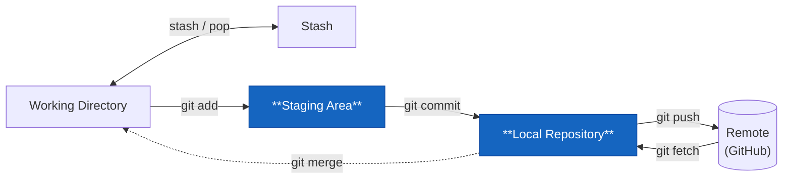

# git commit



Spara en ögonblicksbild av allt som är stagat. Det här är det permanenta steget — en commit är svår att ta bort utan att det märks.

```bash
git commit -m "feat: lägg till rabattkod-validering i kassan"
```

## Bra commit-meddelanden

Ett commit-meddelande har två jobb:

1. Förklara **vad** som ändrats (den korta raden)
2. Förklara **varför** om det inte är uppenbart (brödtext, valfri)

```bash
# Bra
git commit -m "fix: förhindra krasch när kundvagnen är tom"
git commit -m "feat: lägg till dark mode-toggle"
git commit -m "chore: uppdatera NuGet-paket till .NET 8"

# Dåliga
git commit -m "fix"
git commit -m "asdfgh"
git commit -m "borde funka nu"
git commit -m "Karls ändringar"
```

Tumregel: kan du fylla i meningen "Den här committen kommer att ___"? Det är ett bra commit-meddelande.

## Conventional Commits

Standard i många team — prefix talar om vad typen av ändring är:

```
feat:     ny funktion
fix:      buggfix
docs:     dokumentation
chore:    inget som påverkar användaren
refactor: omstrukturering utan nytt beteende
test:     lägga till eller ändra tester
```

Verktyg som `semantic-release` kan automatiskt sätta versionsnummer och generera en CHANGELOG baserat på dessa prefix.

## Commit med brödtext

```bash
git commit -m "fix: förhindra krasch när kundvagnen är tom

Kassan kastade NullReferenceException om användaren gick direkt
till checkout utan att lägga till något. Lade till en null-check
och omdirigerar till kundvagnen med ett felmeddelande istället.

Closes #87"
```

Tomraden mellan ämnesraden och brödtexten är obligatorisk — utan den behandlar Git alltihop som en lång rad.

## Flags att känna till

```bash
git commit --amend          # ändra senaste committen (meddelande eller innehåll)
git commit --amend --no-edit  # lägg till fler filer utan att ändra meddelandet
```

**Obs:** `--amend` skriver om historiken. Kör aldrig `--amend` på en commit du redan pushat till en delad branch — du skapar problem för alla andra på branchen.
