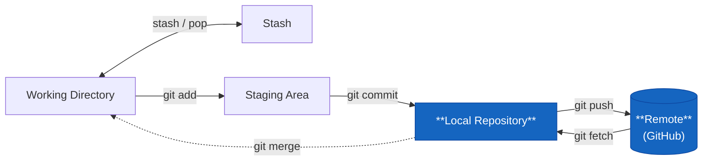

# git fetch



Hämta ändringar från remote — utan att röra din lokala kod.

```bash
git fetch
git fetch origin          # hämta från origin specifikt
git fetch --all           # hämta från alla remotes
```

## Vad är skillnaden mot `git pull`?

`git pull` = `git fetch` + `git merge`. Det hämtar **och** integrerar ändringarna direkt.

`git fetch` hämtar bara — du bestämmer själv vad som händer sen. Bra om du vill se vad som hänt på remote innan du bestämmer dig för att mergea.

```bash
git fetch
git log HEAD..origin/main    # se commits på remote som du inte har lokalt
git diff HEAD origin/main    # se exakt vad som skiljer sig
git merge origin/main        # mergea när du är redo
```

## Håll koll på vad som hänt

```bash
git fetch
git log --oneline origin/main -10    # de senaste 10 commits på main
```

Bra i början av dagen — kolla vad kollegorna pushat under natten innan du börjar jobba.

## Fetch och remote-tracking branches

När du kör `git fetch` uppdateras `origin/main`, `origin/feature/rabattkod` och liknande — de lokala kopiorna av remote-brancherna. De ändras **aldrig** automatiskt, bara via fetch. Din lokala `main` är opåverkad tills du faktiskt mergear.
