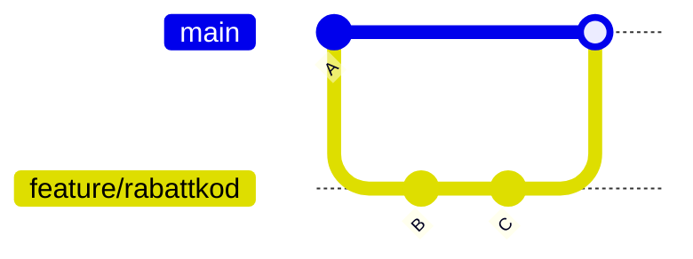
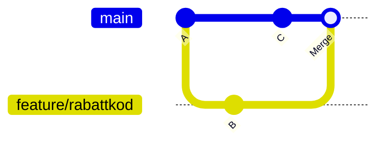

# git merge

Slå ihop två branches.

```bash
git switch main
git merge feature/rabattkod
```

Du är på branchen som ska **ta emot** ändringarna och anger branchen som ska **mergas in**.

## Fast-forward merge

Om `main` inte har några nya commits sedan feature-branchen skapades behövs ingen merge-commit — Git "spolar bara framåt":



Resultatet ser ut som om du alltid jobbat direkt på `main`. Ingen extra commit.

## Three-way merge

Om `main` har fått egna commits medan du jobbat på feature-branchen skapar Git en merge-commit:



## Tvinga merge-commit

```bash
git merge --no-ff feature/rabattkod
```

Skapar alltid en merge-commit, även om fast-forward vore möjlig. Bra om du vill att historiken tydligt ska visa att en feature-branch mergades.

## Avbryta en merge

Är du mitt i en merge med konflikter och vill backa?

```bash
git merge --abort
```

Återställer allt till läget innan merge påbörjades.

Se [Merge-konflikter](../konflikter/merge-konflikt.md) om du fastnar i konflikter.
