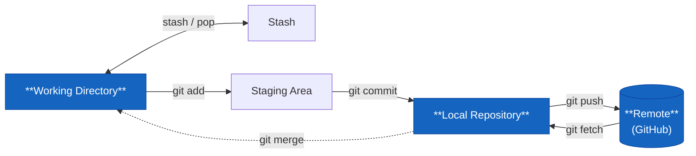

# git pull



Hämta och integrera ändringar från remote i ett steg.

```bash
git pull
```

Det är kortformen för `git fetch` + `git merge origin/<din branch>`.

## Merge vs rebase vid pull

Som standard skapar `git pull` en merge-commit om det finns divergerande historik — din lokala branch och remote har gått åt olika håll. Det ser ut såhär i loggen:

```plaintext
* a3f8c21 Merge branch 'main' of github.com:...
|\
| * 9d2e1f0 Pellas commit
* | 7b4a3c8 Din commit
```

Vill du ha en renare historik:

```bash
git pull --rebase
```

Det spelar av dina lokala commits ovanpå det som kom från remote — inga merge-commits.

Sätt det som standard:

```bash
git config --global pull.rebase true
```

## Innan du börjar jobba

```bash
git pull
```

Kör det här varje morgon, eller varje gång du byter tillbaka till en delad branch. Det förhindrar att du bygger på gammal kod och sedan får lösa konflikter i onödan.

## Om pull misslyckas

```plaintext
error: Your local changes to the following files would be overwritten by merge
```

Git vägrar mergea för att du har lokala ändringar som inte är committade. Lösning:

```bash
git stash       # parkera ändringarna
git pull        # hämta
git stash pop   # plocka tillbaka ändringarna
```
