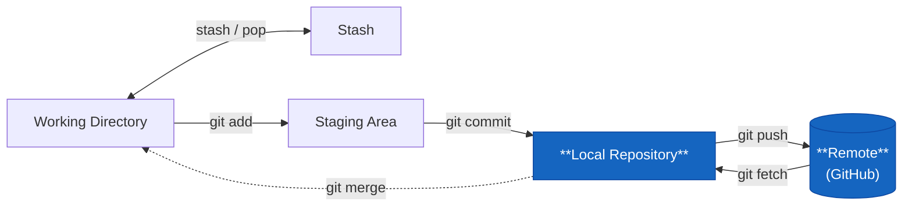

# git push



Skicka dina lokala commits till remote.

```bash
git push
```

Fungerar om du redan har en tracking branch satt. Annars:

```bash
git push -u origin feature/rabattkod
```

`-u` sätter tracking — nästa gång räcker det med `git push`.

## Första push av en ny branch

```bash
git checkout -b feature/rabattkod
# jobba, committa...
git push -u origin feature/rabattkod
```

GitHub svarar direkt med en länk för att öppna en Pull Request.

## Force push — och när du inte ska använda det

```bash
git push --force          # farlig
git push --force-with-lease  # säkrare variant
```

Force push skriver över historiken på remote. Kör det bara på din egna branch, och bara när du vet att ingen annan har hämtat den.

`--force-with-lease` är snällare — den vägrar om remote har commits du inte har lokalt. Bra skyddsnät.

**Kör aldrig force push på `main`.** Någonsin.

## Push av tags

```bash
git push origin v1.2.0       # push en specifik tag
git push --tags              # push alla lokala tags
```

Tags pushas inte automatiskt med `git push` — de måste pushas explicit.
