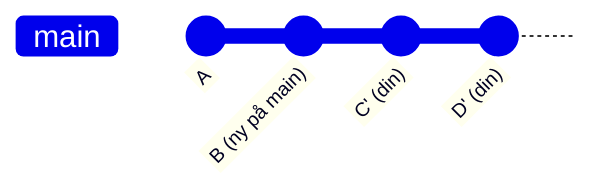

# git rebase

Flytta din branch till en ny startpunkt genom att spela av dina commits ovanpå en annan branch.

```bash
git switch feature/rabattkod
git rebase main
```

Det här tar alla commits på `feature/rabattkod` och spelar av dem ovanpå nuvarande `main`, en i taget. Resultatet ser ut som om du brancha ut från den senaste versionen av `main` från första början.



Jämför med merge som hade skapat en merge-commit. Rebase ger en linjär, ren historik.

## Interaktiv rebase — redigera historiken

```bash
git rebase -i HEAD~3    # redigera de tre senaste commits
```

```plaintext
pick a3f8c21 feat: lägg till rabattkod-input
pick 9d2e1f0 fix: typo
pick 7b4a3c8 feat: validera rabattkod mot API

# Kommandon:
# p, pick = använd commit
# r, reword = använd commit, men ändra meddelandet
# s, squash = kombinera med föregående commit
# d, drop = ta bort commit
```

Bra för att:
- Slå ihop småfixar med rätt commit (`squash`)
- Fixa ett dåligt commit-meddelande (`reword`)
- Ta bort en commit som inte ska vara med (`drop`)
- Sortera om commits

## Den viktigaste regeln

> **Rör aldrig en delad branch med rebase.**

Rebase skriver om commit-hashar. Om du rebasar en branch som någon annan har hämtat har du skrivit om historiken de bygger på. Deras commits pekar nu på commits som inte finns längre.

Rebase är säkert på din **egna** lokala branch, innan du pushat eller delar den med andra.

## Avbryta en rebase

```bash
git rebase --abort
```

Tar dig tillbaka till läget innan rebaser påbörjades.

Om du är mitt i en rebase med konflikter, löst konflikterna och vill fortsätta:

```bash
git rebase --continue
```
