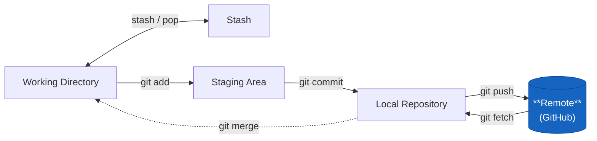

# git remote



Hantera kopplingar till fjärrrepon.

## Lista remotes

```bash
git remote -v
```

```plaintext
origin  git@github.com:marcusjobb/git-bok.git (fetch)
origin  git@github.com:marcusjobb/git-bok.git (push)
```

`-v` (verbose) visar URL:erna. Utan `-v` ser du bara namnen.

## Lägga till en remote

```bash
git remote add origin git@github.com:dittnamn/repo.git
```

`origin` är bara ett namn — konventionellt namnet för det primära fjärrrepot. Du kan kalla det vad som helst.

## Vanligt scenario — fork-arbetsflöde

Du forkat ett repo och vill kunna hämta uppdateringar från originalet:

```bash
git remote add upstream git@github.com:originalet/repo.git
git fetch upstream
git merge upstream/main
```

Nu har du två remotes: `origin` (din fork) och `upstream` (originalet).

## Byta URL på en remote

```bash
git remote set-url origin git@github.com:nyttnamn/repo.git
```

Behövs exempelvis om ett repo bytt namn eller om du byter från HTTPS till SSH.

## Ta bort en remote

```bash
git remote remove upstream
```

Påverkar inte det lokala repot — tar bara bort kopplingen.
