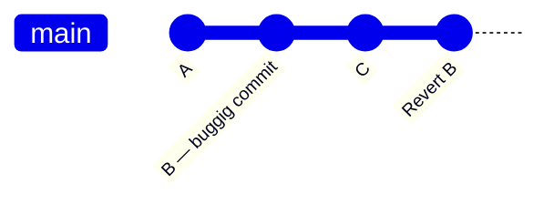

# git revert

Ångra en commit — men på ett säkert sätt som fungerar på delade branches.

```bash
git revert a3f8c21
```

Istället för att ta bort committen skapar `git revert` en **ny commit** som gör det omvända av den gamla. Historiken förblir intakt — det syns tydligt att något angrades och varför.

## Varför inte `git reset`?

[`git reset`](reset.md) skriver om historiken — farligt om du redan pushat till en delad branch. `git revert` lägger till en ny commit, skriver inte om något. Säkert att pusha efteråt.



Commit `B` finns kvar i historiken. `Revert B` är en ny commit som tar tillbaka exakt vad `B` gjorde.

## Ångra utan att committa direkt

```bash
git revert --no-commit a3f8c21
```

Ändringarna landar i staging area utan att en commit skapas. Bra om du vill justera något innan du committar, eller om du vill ångra flera commits och slå ihop dem till en enda revert-commit.

```bash
git revert --no-commit a3f8c21
git revert --no-commit 9d2e1f0
git commit -m "revert: ta tillbaka rabattkods-implementationen"
```

## Ångra en merge-commit

```bash
git revert -m 1 <merge-commit-hash>
```

`-m 1` talar om för Git vilken "förälder" som är mainline — utan det vet den inte vad som ska ångras i en merge.

## reset vs revert — när vad

| Situation | Använd |
|-----------|--------|
| Committen är inte pushad ännu | `git reset` |
| Committen är pushad till delad branch | `git revert` |
| Du vill att historiken ska visa att något angrades | `git revert` |
| Du vill att historiken ska se ut som om det aldrig hände | `git reset` (lokalt) |
