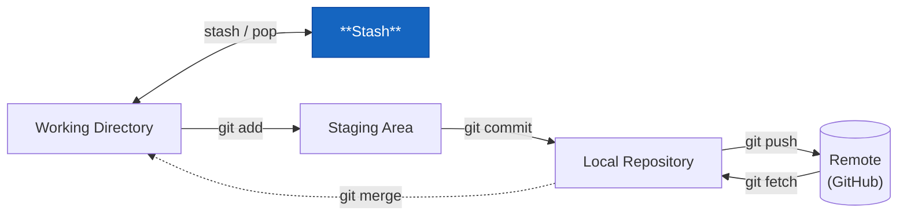

# git stash



Du håller på med en feature. Halvvägs in ringer chefen och vill att du fixar en akut bugg på `main` — nu. Koden är inte klar, du kan inte committa halvfärdigt skräp.

`git stash` räddar dig: det parkerar alla dina ändringar i en temporär hög och återställer working directory till senaste clean commit.

```bash
git stash
```

Nu är working directory rent. Byt branch, fixa buggen, committa, byt tillbaka.

```bash
git checkout main
# fixa buggen
git commit -m "fix: åtgärda null-krasch i kassan"
git checkout feature/rabattkod
git stash pop          # plocka tillbaka det du lade undan
```

## Ge stashen ett namn

```bash
git stash push -m "halvfärdig rabattkod-logik"
```

Utan namn ser stashlistan ut såhär:

```
stash@{0}: WIP on feature/rabattkod: a3f8c21 feat: ...
stash@{1}: WIP on feature/login: 9d2e1f0 fix: ...
```

Med namn är det lättare att se vad som är vad om du har flera stashes.

## Hantera flera stashes

```bash
git stash list                  # lista alla stashes
git stash show stash@{1}        # visa vad stash@{1} innehåller
git stash pop stash@{1}         # plocka tillbaka en specifik stash
git stash drop stash@{0}        # ta bort en stash du inte behöver
git stash clear                 # ta bort alla stashes
```

## Stasha inklusive untracked files

Som standard ignorerar `git stash` filer som Git inte känner till ännu. Lägg till `-u` för att ta med dem:

```bash
git stash -u
```

## Snabbvarning

En stash är lokal — den pushas inte till GitHub. Om du tappar bort din dator eller råkar köra `git stash clear` av misstag är stasharna borta. Lita inte på stash för långtidsförvaring — committa hellre (på en work-in-progress branch) om det handlar om mer än ett par timmar.
