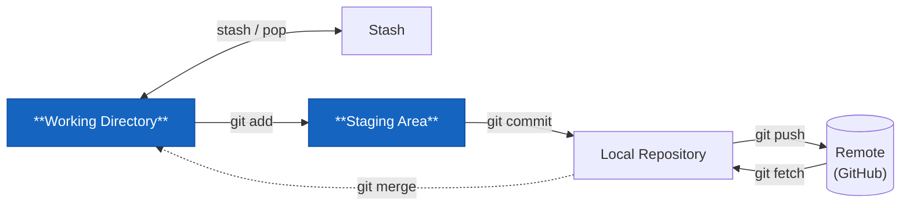

# git status



Kolla läget. Kör det här innan du gör **något** annat.

```bash
git status
```

## Vad det visar

```plaintext
On branch feature/rabattkod
Changes to be committed:
  (use "git restore --staged <file>..." to unstage)
        modified:   Kassan.cs

Changes not staged for commit:
  (use "git add <file>..." to update what will be committed)
        modified:   Program.cs

Untracked files:
  (use "git add <file>..." to include in what will be committed)
        Rabattkod.cs
```

Tre kategorier:

| Kategori | Betyder |
|----------|---------|
| **Changes to be committed** | Stagat — ingår i nästa `git commit` |
| **Changes not staged for commit** | Ändrat men inte stagat — ingår **inte** i nästa commit |
| **Untracked files** | Git känner inte till filen alls ännu |

## Kort version

```bash
git status -s
```

```plaintext
M  Kassan.cs
 M Program.cs
?? Rabattkod.cs
```

Första kolumnen = staging area. Andra kolumnen = working directory. `??` = untracked.

## Ritualen

```
git status → git add → git commit → git push
```

Varje gång. Utan undantag. Det tar tre sekunder och räddar dig från att committa fel filer.
