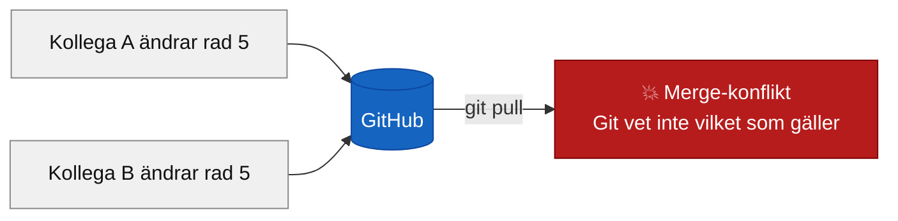
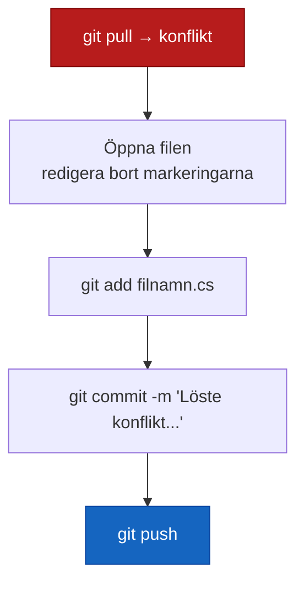

# Merge-konflikt

## Vad som händer

En merge-konflikt uppstår när Git inte kan slå ihop två versioner av samma fil automatiskt. Det händer när du och någon annan (eller du på två ställen) har ändrat **samma rad** i samma fil, och Git inte vet vilken version som ska gälla.

```bash
git pull

# Output vid konflikt:
CONFLICT (content): Merge conflict in Program.cs
Automatic merge failed; fix conflicts and then commit the result.
```



## Konfliktmarkering

När en merge-konflikt uppstår lägger Git in markeringar direkt i filen för att visa de två versionerna:

```csharp
<<<<<<< HEAD
Console.WriteLine("Vi gör det tillsammans. Det är vad ett team gör.");
=======
Console.WriteLine("Vi löser det här på egen hand.");
>>>>>>> origin/main
```

| Markering | Vad den betyder |
|-----------|-----------------|
| `<<<<<<< HEAD` | Din version börjar här |
| `=======` | Skiljelinjen mellan de två versionerna |
| `>>>>>>> origin/main` | Serverns version slutar här |

Du måste manuellt välja vad filen ska innehålla och ta bort alla tre markeringarna. De ska inte vara kvar i slutresultatet.

**Tre sätt att lösa:**

**Behåll din version** — ta bort serverns del och markeringarna:
```csharp
Console.WriteLine("Vi gör det tillsammans. Det är vad ett team gör.");
```

**Behåll serverns version** — ta bort din del och markeringarna:
```csharp
Console.WriteLine("Vi löser det här på egen hand.");
```

**Kombinera båda** — ta bort markeringarna, behåll båda raderna:
```csharp
Console.WriteLine("Vi gör det tillsammans. Det är vad ett team gör.");
Console.WriteLine("Vi löser det här på egen hand.");
```

I VS Code och Rider syns konfliktmarkeringarna med knappar ovanför: **Accept Current Change**, **Accept Incoming Change**, **Accept Both Changes**. Använd knapparna — det är lättare än att redigera markeringarna för hand.

## Lösa en konflikt (ritualen)

När du har redigerat filen och tagit bort alla konfliktmarkeringar:

```bash
git status                               # verifiera — ska inte visa "both modified"
git add Program.cs                       # markera filen som löst
git commit -m "Löste konflikt i Program.cs"
git push
```



`git status` visar `both modified` så länge konflikten finns kvar. Efter `git add` är den markerad som löst.

## git merge --abort

Ångrar ett pågående merge-försök och återställer koden till läget precis innan `git pull`. Användbart om konflikten är förvirrande och du vill börja om med klarare huvud.

```bash
git merge --abort
```

Fungerar bara om du **inte** redan kört `git add` och `git commit` på konflikten. Kör du den efter commit händer ingenting — commiten är redan gjord.

**När använder man det?**

- Du körde `git pull` och fick fem konflikter i filer du inte förstår
- Du vill prata med en kollega om hur filerna ska slås ihop innan du bestämmer dig
- Du råkade köra `git pull` på fel branch

Efter `git merge --abort` kan du köra `git status` och se att allt är tillbaka till normalt.

## "both modified"

Det Git skriver i `git status` när en fil har en olöst merge-konflikt:

```bash
git status

# Output:
Unmerged paths:
  (use "git add <file>..." to mark resolution)
        both modified:   Program.cs
```

`both modified` = du och någon annan har båda ändrat filen. Git väntar på att du löser konflikten och kör `git add`.
