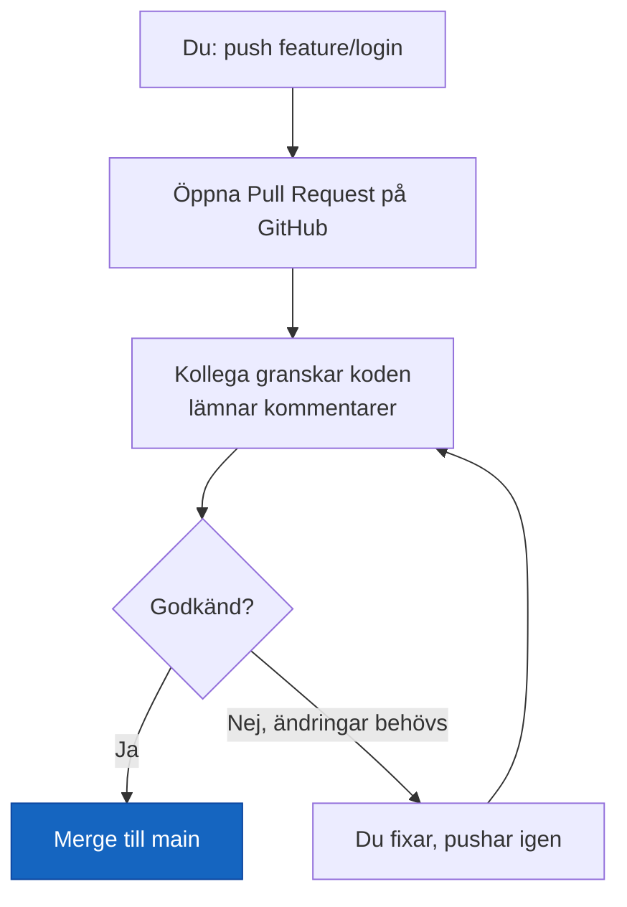
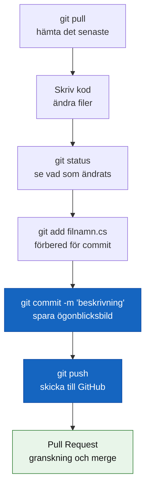

# README och Pull Request

## README.md

README är projektets välkomstsida — den fil GitHub visar automatiskt när någon besöker ett repo. Varje projekt ska ha en.

En bra README innehåller:

1. **Vad projektet är** — en mening
2. **Hur man kör det** — steg för steg
3. **Vad man behöver** — förutsättningar (t.ex. .NET 10)
4. **Vem som gjort det** — och eventuell licens

````markdown
# Gissningsspel

Ett enkelt terminalspel i C# där du gissar ett hemligt tal.

## Krav

- .NET 10 SDK

## Kör spelet

```bash
git clone git@github.com:dittnamn/gissningsspel.git
cd gissningsspel
dotnet run
```

## Regler

Gissa ett tal mellan 1 och 100. Du får veta om din gissning är för högt eller för lågt.
````

README skrivs alltid i Markdown och heter alltid `README.md` — med versaler, för det är konvention.

## Pull Request

En Pull Request (PR) är en förfrågan att mergea en branch till en annan — och en möjlighet för teamet att granska koden innan den hamnar i huvudgrenen. Det är GitHubs funktion, inte Gits.



En PR innehåller vanligtvis: en titel, en beskrivning av vad som ändrades och varför, och eventuellt skärmdumpar om det är UI-ändringar. Allt detta skrivs i — Markdown.

**Vad gör en bra PR-beskrivning?** Samma regel som commit-meddelanden: förklara **varför**, inte bara vad. En granskare som förstår syftet kan ge bättre feedback än en som bara ser en diff.

## Sammanfattning: Git-arbetsflödet


